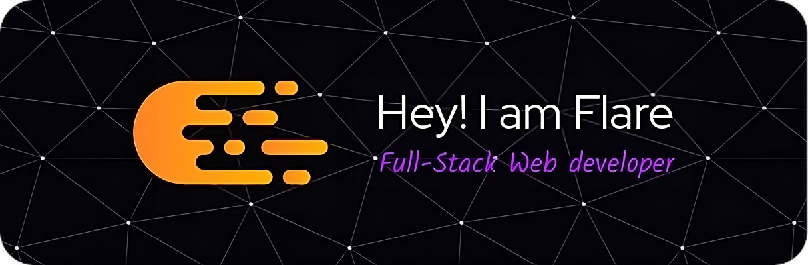

My name is Muhammad Maher, I'm a JavaScript developer, Full-Stack web developer, and a Linux enthusiast (I use Arch by the way 😁)

##  About Me

- :school: I'm an information systems student at [Higher Institute of Computer Science](https://www.cis.edu.eg/) in [New Cairo Academy](https://en.wikipedia.org/wiki/New_Cairo_Academy)
- :technologist: I've been a programming since I was 8 years old, so programming takes a special place in my heart
- :fire: I love competitive programming and problem-solving

##  My Skills

 

Now if you'll excuse me, I'll get back to work now.

